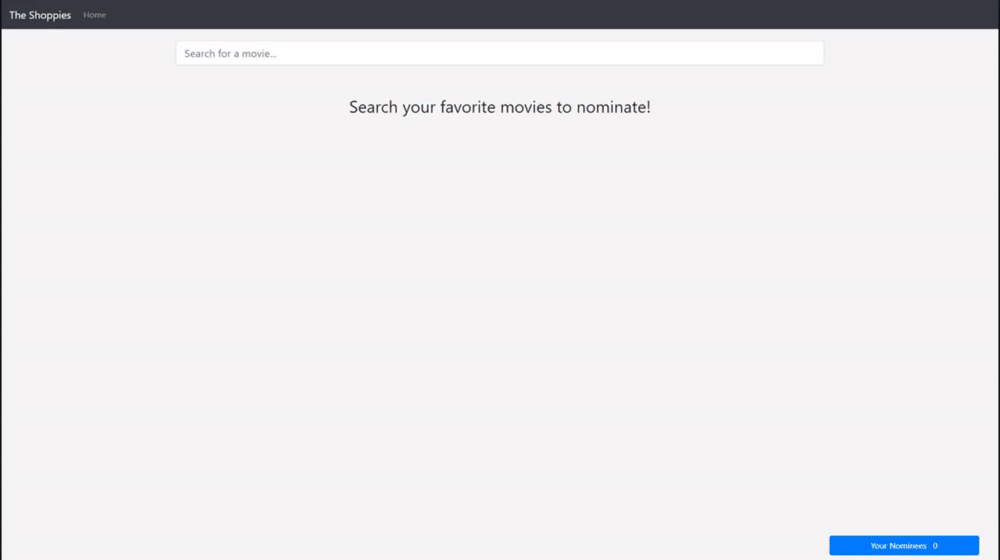
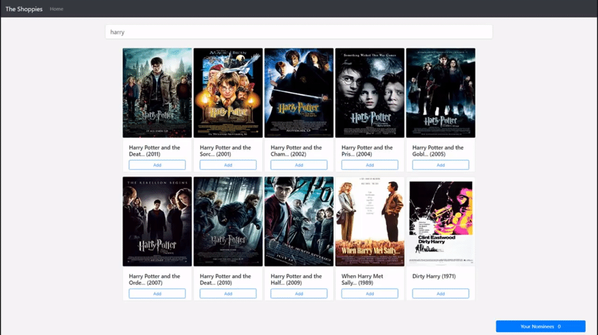
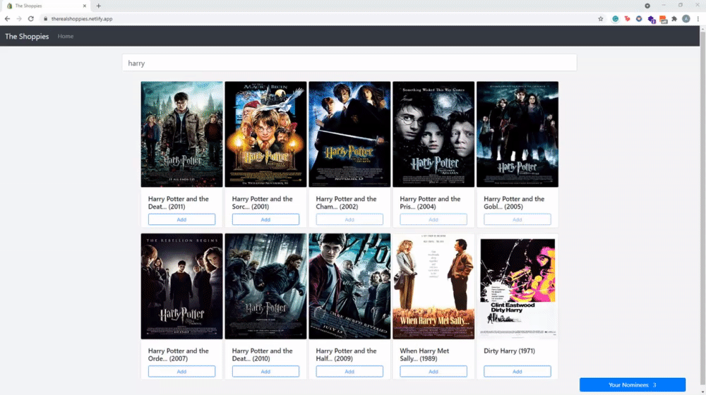
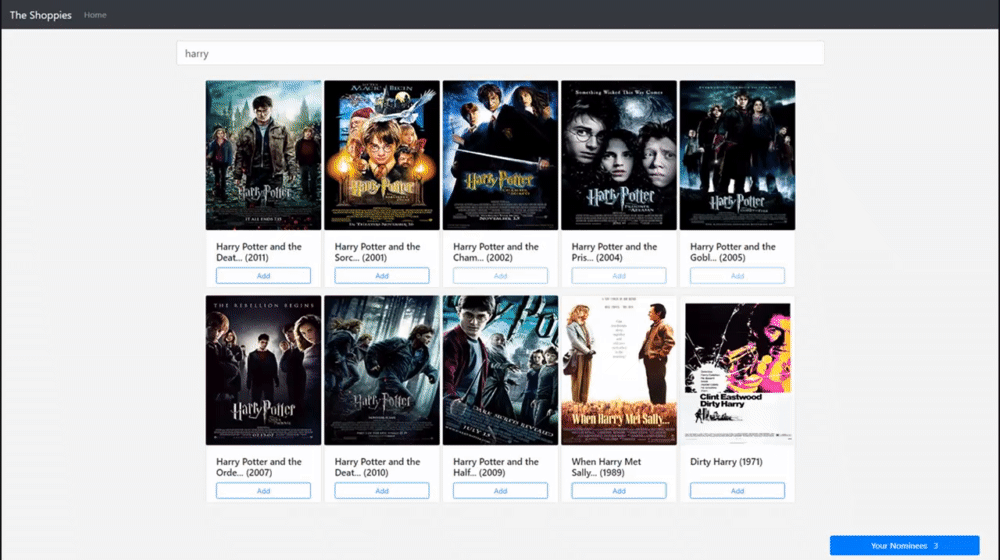
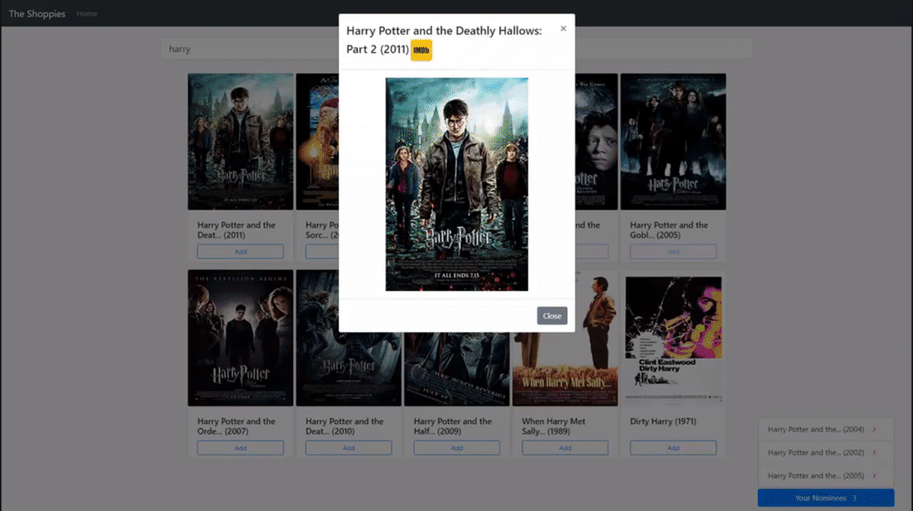
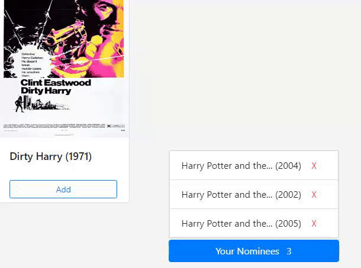
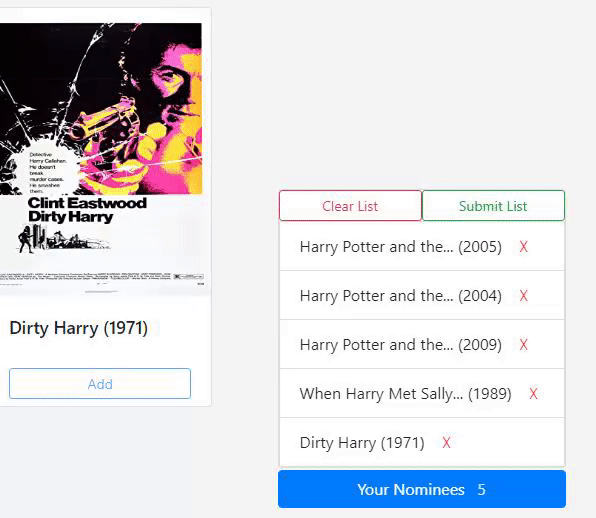

<h1 align="center"> The Shoppies </h1>

Shopify Fall 2021 Frontend Developer Intern Challenge

You can find a demo [here](https://therealshoppies.netlify.app/).
## Table of Contents

1. [Tools](#Tools)
2. [Features](#Features)
    1. [Search as you type](##Search as you type)
    2. [Nominate movies](#)
    3. [Persistent data](#)
    4. [Submit nominations](#)
    5. [Movie preview](#)
    6. [View more details](#)
    7. [Remove movies from nomination list](#)
    8. [Clear nominations](#)
3. [Setup](#Setup)
# Tools

+ React
+ React Bootstrap
+ React-Redux
    - Redux-Persist
    - Reselect
+ Styled-Components
# Features
## Search as you type

Search for your favorite movies as you type! For every key you press your search will be updated right away. It will also be updated if you delete a character.

> Searching movies in real time
## Nominate movies

Find you favorite movies and nominate them to The Shoppies Awards.

## Persistent data

If you are not sure what are your five nominations you can come later and complete the list. The previous movies you added to the list will be saved automatically.

## Submit nominations

When you are decided on your five nominations, submit your list.

## Movie preview

A larger preview of the movie poster is available by clicking the movie title or image. You can also preview movies in the nomination list by clicking on their title.

## View more details

By clicking the imdb button inside the preview you will open a new tab with more information about the movie.

## Remove movies from nomination list

Removing a movie from the list is super easy, you only need to press the X and you will have space for another one.

## Clear nominations

All movies in the list will be removed so you can choose other movies if you changed your opinion.

# Setup

If you wish to run the project locally you can follow these steps:

+ `npm install`
  - Install necessary dependencies to run the application locally.
+ `npm start`

  - Runs the app in the development mode.
+ Open [http://localhost:3000](http://localhost:3000) to view it in the browser.